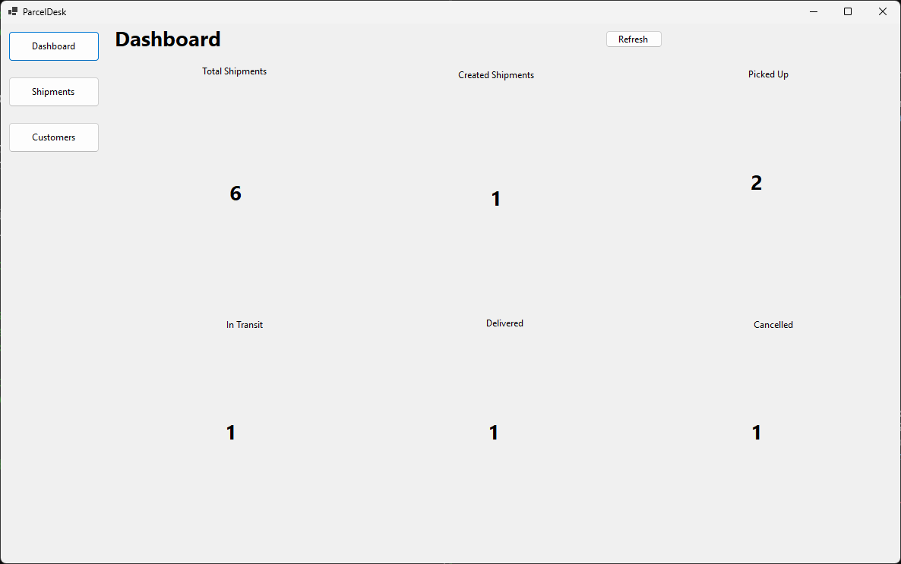
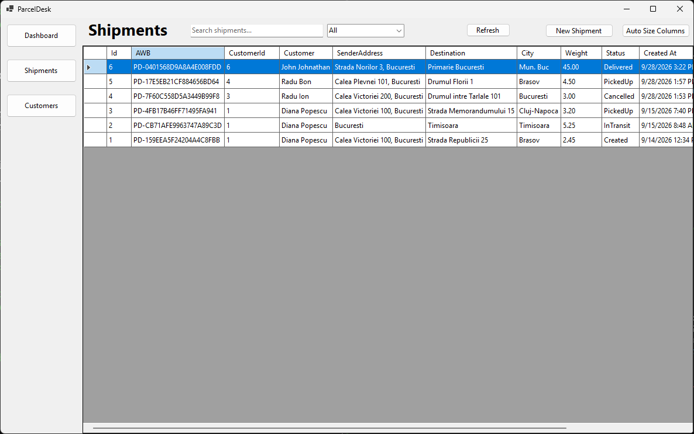
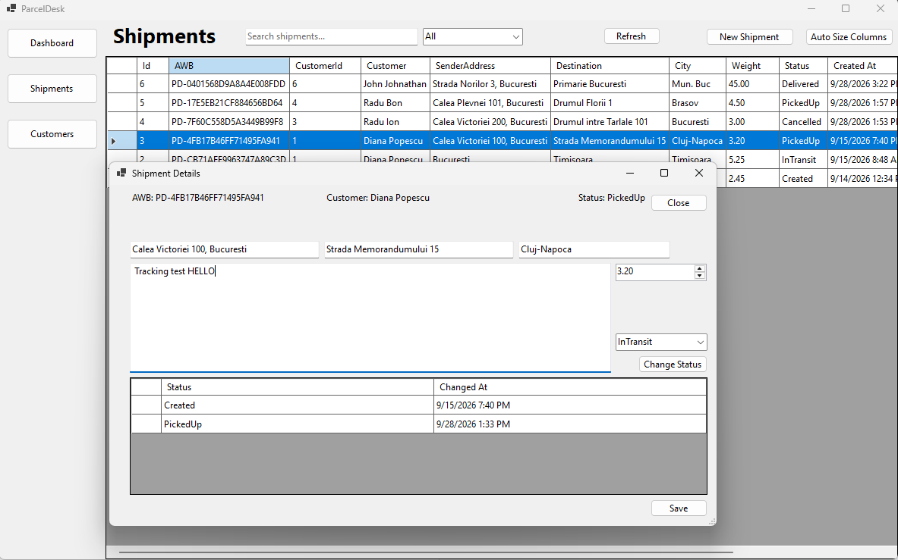
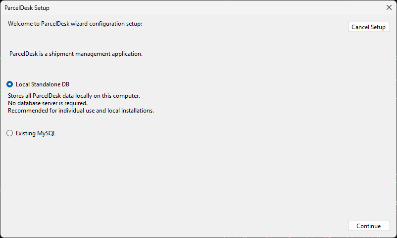
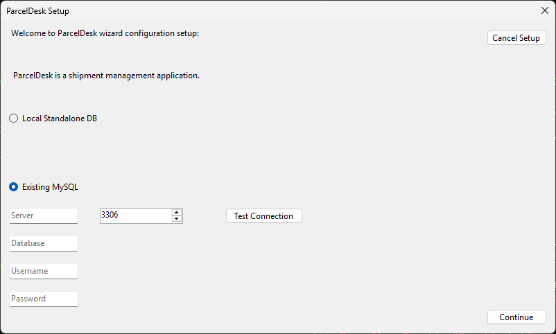
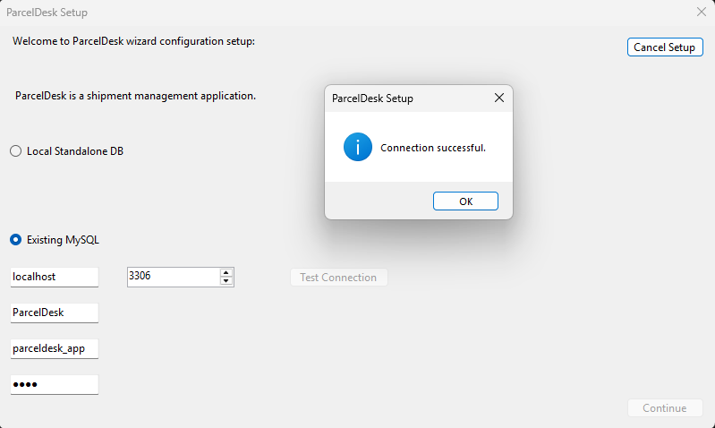

# ParcelDesk


[](https://github.com/DrX-svg/ParcelDesk/releases/latest)


ParcelDesk is a Windows desktop application for managing customers, parcel
shipments, shipment status history and delivery workflows.

It was built as a full-stack .NET desktop project using a REST API architecture,
Entity Framework Core and configurable database persistence.

## Download

The latest Windows installer is available from the
[ParcelDesk v0.2.0 release](https://github.com/DrX-svg/ParcelDesk/releases/tag/v0.2.0).

**Windows x64 · Self-contained · No separate .NET installation required**

## Screenshots

### Dashboard


### Shipment Management


### Shipment Details and Status History


### First-run Setup


## Features

- Customer management
- Shipment creation and editing
- Server-generated AWB numbers
- Shipment status workflow
- Full shipment status history
- Search and filtering
- Dashboard statistics
- Persistent DataGridView preferences
- First-run setup wizard
- Local standalone mode using SQLite
- Existing MySQL database support
- Secure MySQL password storage using Windows DPAPI
- Automatic local API startup and shutdown
- Self-contained Windows deployment
- Windows installer and uninstaller
- Optional preservation of the local database during uninstall

## Architecture

ParcelDesk uses a client-server architecture even when running locally:

```text
┌─────────────────────────────┐
│ ParcelDesk WinForms Client  │
└──────────────┬──────────────┘
               │ HTTP / REST
               ▼
┌─────────────────────────────┐
│      ASP.NET Core API       │
│                             │
│ Controllers → Services      │
└──────────────┬──────────────┘
               │
               ▼
┌─────────────────────────────┐
│       Entity Framework      │
└──────────────┬──────────────┘
               │
        ┌──────┴───────┐
        ▼              ▼
     SQLite          MySQL
```

The WinForms application never accesses the database directly.

## Technology Stack

- C#
- .NET 10
- Windows Forms
- ASP.NET Core
- REST API
- Entity Framework Core
- SQLite
- MySQL
- LINQ
- async / await
- Windows DPAPI
- Inno Setup
- Git

## Database Modes

### Local Standalone

The recommended option for individual installations.

ParcelDesk automatically creates a SQLite database under the current Windows
user profile. No external database server is required.

### Existing MySQL

ParcelDesk can also connect to an existing MySQL database.

Database credentials are configured during first-run setup. The MySQL password
is protected using Windows DPAPI and is not stored in plaintext inside the
application settings file.

ParcelDesk can test the database connection before saving the configuration.




## Shipment Workflow

```text
Created
   ├── PickedUp
   │      ├── InTransit
   │      │      ├── Delivered
   │      │      └── Cancelled
   │      └── Cancelled
   └── Cancelled
```

`Delivered` and `Cancelled` are terminal states.

Every successful status change is recorded in the shipment history.

## Installation

Download:

```text
ParcelDesk-Setup.exe
```

Run the installer and launch ParcelDesk.

On first launch, choose either:

- Local Standalone
- Existing MySQL Database

The application is self-contained and does not require a separate .NET runtime
installation.

## Building From Source

Requirements:

- Windows
- .NET 10 SDK
- Visual Studio 2026 or compatible tooling

Restore and build:

```powershell
dotnet restore
dotnet build ParcelDesk.sln
```

Build the complete Windows installer:

```powershell
.\installer\build-installer.ps1
```

The generated installer will be available under:

```text
dist\ParcelDesk-Setup.exe
```

## Security Scope

ParcelDesk v0.2 is designed as a local-first desktop application.

The packaged API runs locally and is not intended to be exposed directly to the
public internet.

MySQL passwords are protected using Windows DPAPI for the current Windows user.

Authentication and authorization are outside the current release scope.

## Current Version

**v0.2.0**

This release introduces standalone deployment, SQLite support, secure MySQL
configuration, automatic backend management and a Windows installer.

## License

ParcelDesk is **source-available** under the
[PolyForm Noncommercial License 1.0.0](LICENSE).

You may use, study, modify and distribute ParcelDesk for permitted
noncommercial purposes under the terms of that license.

**Commercial use requires a separate license from the copyright holder.**

See [COMMERCIAL-LICENSING.md](COMMERCIAL-LICENSING.md) for more information.
